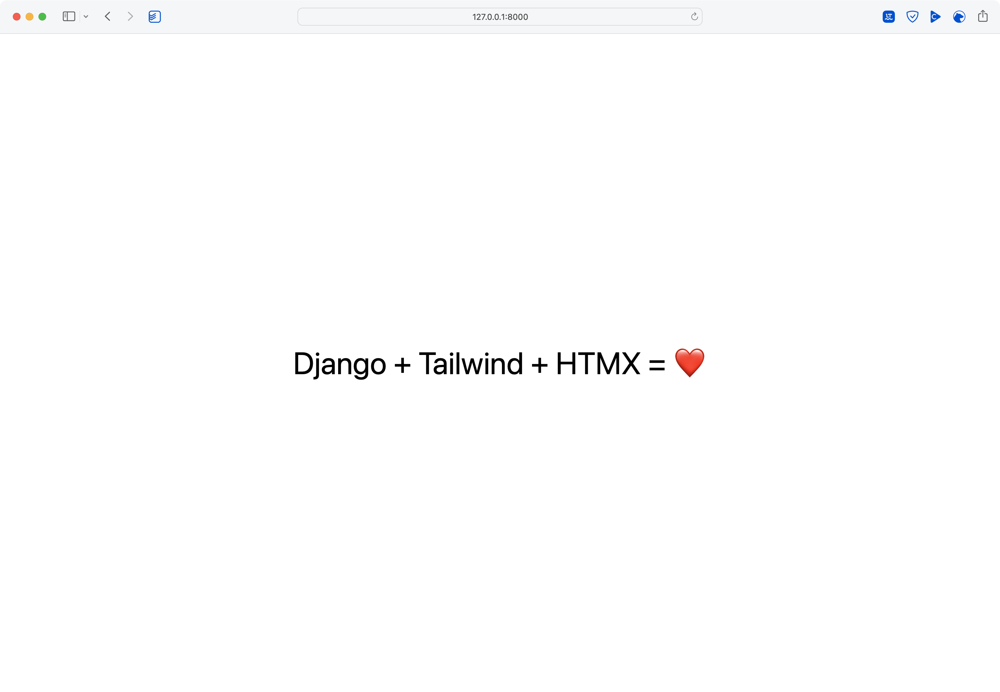

# django-poetry-startproject



> Django startproject template with some poetry.

I took the inspiration from Jeff Triplett's [django-startproject](https://github.com/jefftriplett/django-startproject) and created my own starter for a fresh django project. It includes the batteries I use regularly. 🤷‍♂️

The template is also inspired by Carlton Gibson's Post [The Single Folder Django Project Layout](https://noumenal.es/notes/django/single-folder-layout/). It uses the single folder layout as a start as I always run in the same situation Carlton describes in his post. If you have to split the project into several apps, you can always call `python manage.py startapp` later on.

Out of the box SQLite is configured, but you can easily activate MySQL or Postgres support by following the steps add the end of this file.

## Features

- Python 3.12
- Django 5.0.x
- django-browser-reload
- django-htmx
- django-tailwind-cli
- django-dirtyfields
- environs
- whitenoise
- SQLite setup with WAL mode enabled (See `<project_name>/__init__.py`.)
- [Argon2 password hashing is activated](https://docs.djangoproject.com/en/4.1/topics/auth/passwords/)
- Local install of htmx.
- uses the [single folder Django project layout](https://noumenal.es/notes/django/single-folder-layout/)

### Development tools

- django-types
- django-test-plus
- model-bakery
- pytest incl. pytest-cov, pytest-django and pytest-mock
- pre-commit setup inspired by [Boost your Django DX](https://adamchainz.gumroad.com/l/byddx)
- sane ruff configuration

## Install

```shell
django-admin startproject \
    --extension=ini,py,toml,yaml,yml \
    --template=https://github.com/oliverandrich/django-poetry-startproject/archive/main.zip \
    example_project

# Setup environment
cd example_project
echo "DEBUG=true" >> .env

# Install dependencies
poetry install

# Migrate database
poetry run ./manage.py migrate

# Start dev server
poetry run ./manage.py tailwind runserver

# Or if you prefer django-extensions runserver_plus
poetry run ./manage.py tailwind runserver_plus

```

### Add Postgres support

```shell
cd example_project
poetry add psycopg2-binary
```

Set the environment variable DATABASE_URL to [something reasonable](https://django-environ.readthedocs.io/en/latest/types.html#environ-env-db-url)

### Add MySQL support

```shell
cd example_project
poetry add mysqlclient django-mysql
```

Follow the [installation instructions](https://django-mysql.readthedocs.io/en/latest/installation.html#id1) of `django-mysql` and set the environment variable DATABASE_URL to [something reasonable](https://django-environ.readthedocs.io/en/latest/types.html#environ-env-db-url)

## Environemt Variables for Docker

Or when run as a [12-Factor application](https://12factor.net).

| Environment Variable         | Default                               | Location         |
| ---------------------------- | ------------------------------------- | ---------------- |
| ADMIN_URL                    | "admin/"                              | settings.py      |
| ALLOWED_HOSTS                | []                                    | settings.py      |
| CACHE_URL                    | "locmem://"                           | settings.py      |
| CSRF_TRUSTED_ORIGINS         | []                                    | settings.py      |
| DATABASE_URL                 | "sqlite:///db.sqlite3"                | settings.py      |
| DEBUG                        | False                                 | settings.py      |
| EMAIL_URL                    | "console:"                            | settings.py      |
| GUNICORN_BIND                | "0.0.0.0:8000"                        | gunicorn.conf.py |
| GUNICORN_MAX_REQUESTS        | 1000                                  | gunicorn.conf.py |
| GUNICORN_MAX_REQUESTS_JITTER | 50                                    | gunicorn.conf.py |
| GUNICORN_WORKERS             | `multiprocessing.cpu_count() * 2 + 1` | gunicorn.conf.py |
| INTERNAL_IPS                 | []                                    | settings.py      |
| LANGUAGE_CODE                | "EN"                                  | settings.py      |
| SECRET_KEY                   | `get_random_secret_key()`             | settings.py      |
| TAILWIND_CLI_PATH            | "~/.local/bin"                        | settings.py      |
| TIME_ZONE                    | "UTC"                                 | settings.py      |

## Docker and docker-compose

The `Dockerfile` uses a multi stage process to embracing caching for building the container images.

## Contributing

Contributions, issues and feature requests are welcome!
Feel free to check [issues page](https://github.com/oliverandrich/django-poetry-startproject/issues).
